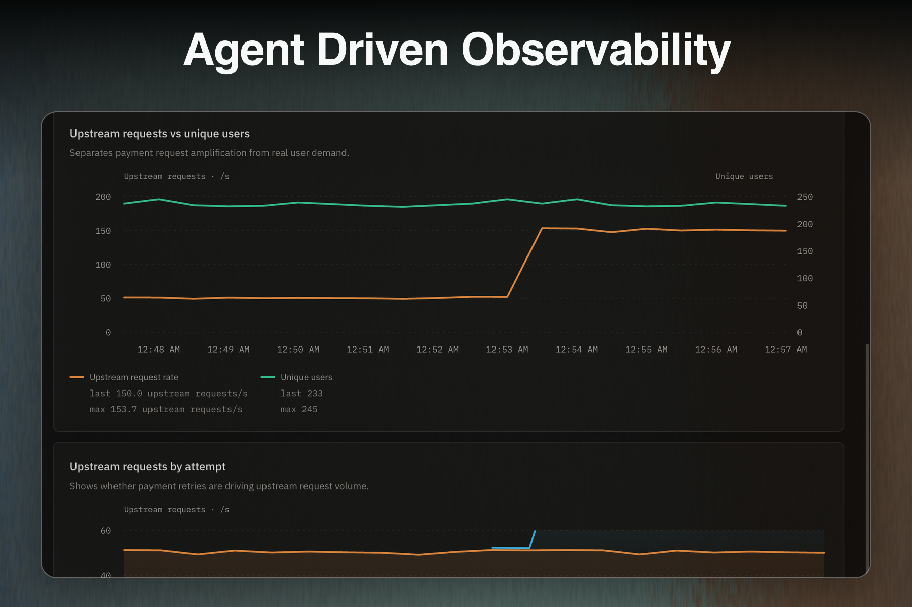

<div align="center">
  
  <h1>Clear</h1>
  <p>
    <a href="https://github.com/quick007/clear/actions/workflows/ci.yml"></a>
    <a href="LICENSE"></a>
  </p>
  <p>
    <a href="https://clear.seufert.sh">Open Clear</a> ·
    <a href="https://clear.seufert.sh/status">Status</a> ·
    <a href="https://api.clear.seufert.sh/docs">API docs</a>
  </p>
</div>

Clear is an OpenTelemetry workspace shared by you and the coding agent that already knows your code.

Through WebMCP, your agent can investigate metrics, logs, and traces, build dashboards, and work through incidents on the same live surface you see. Connect any OTLP/HTTP exporter with a Clear ingest key.

Clear only handles observability. It does not clone your repo, store deploy credentials, or apply fixes. That still happens through your coding agent.

## Try it

1. Open [Clear](https://clear.seufert.sh) in ChatGPT's in-app browser, or in Chrome with WebMCP enabled.
2. Select **Investigate an incident**.
3. Copy the prompt from the board into your agent conversation.
4. Keep the board open while your agent investigates the telemetry and adds panels.

To use your own telemetry, sign in, create a project, and copy its ingest key. Then point an OTLP/HTTP exporter at Clear using the configuration below.

## How it works

```text
OpenTelemetry SDKs and Collectors
              |
              | OTLP/HTTP
              v
        Clear Collector
              |
              v
          Clear API
          /       \
         v         v
  PostgreSQL    ClickHouse
  project data  telemetry
         \         /
          v       v
      Console and WebMCP tools
```

The Go collector receives and authenticates OTLP traffic, then sends project-scoped batches to the TypeScript API. The API stores product data in PostgreSQL, stores telemetry in ClickHouse, and streams live updates to the console using SSE.

The console exposes metrics, logs, traces, alerts, deploys, dashboards, and incidents as WebMCP tools. Incident-specific tools are available while an incident is open. Panels created by an agent are saved to the same board the user is viewing.

Clear also monitors its own hosted services. The [public status page](https://clear.seufert.sh/status) is built from telemetry collected by Clear.

More detail is available in the [architecture guide](docs/architecture.md).

## Send telemetry

Create a project in Clear, copy its ingest key, and configure your OpenTelemetry SDK or Collector:

```sh
export CLEAR_INGEST_KEY=your-ingest-key
export OTEL_EXPORTER_OTLP_ENDPOINT=https://otlp.clear.seufert.sh
export OTEL_EXPORTER_OTLP_PROTOCOL=http/protobuf
export OTEL_EXPORTER_OTLP_HEADERS="x-clear-ingest-key=${CLEAR_INGEST_KEY}"
export OTEL_SERVICE_NAME=my-service
```

The hosted collector accepts OTLP/HTTP protobuf and JSON for all three signals:

- `POST /v1/metrics`
- `POST /v1/logs`
- `POST /v1/traces`

See the [OpenTelemetry quickstart](docs/otel-quickstart.md) for language SDKs, upstream Collector configuration, and a [runnable Node example](examples/node-otel/USAGE.md).

## Example incident

The included example reproduces a retry storm across three instrumented services:

- `checkout-api` retries failed payment requests immediately
- `payments-stub` degrades under load
- `load-generator` drives the incident through repeatable phases

At first, the incident looks like a traffic spike. Incoming checkouts and unique users remain flat while retry traffic grows, which points back to the retry loop. The services emit real metrics, logs, and traces so the same incident can be investigated through the dashboard or WebMCP.

## Run locally

You will need:

- Node.js 24 or newer
- [Vite+](https://viteplus.dev/) 0.3.x
- Docker Engine with Compose v2
- At least 4 GB available to Docker

Create the local configuration and install dependencies:

```sh
cp .env.example .env
cp apps/console/.env.example apps/console/.env.local
cp apps/checkout-web/.env.example apps/checkout-web/.env.local
vp install
vp run ready
```

Start the console:

```sh
vp run dev
```

In another terminal, start the API, databases, collector, and example services:

```sh
docker compose -f infra/compose.yaml up --build
```

| Service           | Local endpoint                                    |
| ----------------- | ------------------------------------------------- |
| Console           | `http://localhost:5173`                           |
| API and reference | `http://localhost:3000`, `/docs`, `/openapi.json` |
| OTLP/HTTP         | `http://localhost:4318`                           |
| OTLP/gRPC         | `localhost:4317`                                  |
| Collector health  | `http://localhost:13133/healthz`                  |
| Checkout API      | `http://localhost:4101`                           |

The checked-in secrets and Compose stack are for local development only. Replace every secret before exposing the stack to a shared machine or network.

## Project structure

```text
apps/
  backend/          Effect API and application services
  collector/        Go OpenTelemetry Collector distribution
  console/          React console and WebMCP tools
  checkout-api/     Instrumented example service with the retry bug
  checkout-web/     Example storefront
  payments-stub/    Controlled upstream dependency
packages/
  api-contract/     Shared Effect API contract
  domain/           Domain models and errors
  panel-dsl/        Agent-authored panel definitions
  persistence/      PostgreSQL and ClickHouse repositories
  telemetry/        Telemetry query and ingest models
  telemetry-gen/    Deterministic sandbox telemetry
examples/
  load-generator/   Retry-storm scenario controller
  node-otel/        Standalone OpenTelemetry Node example
infra/              Local and hosted infrastructure
docs/               Architecture and operations documentation
```

## Hosted limits

- One project per account and up to three active ingest keys
- 24 hours of raw metrics, logs, and traces
- 7 days of metric rollups
- OTLP/HTTP protobuf and JSON ingest
- Single-instance hosting without high availability
- Local Compose is for development and testing, not a supported self-hosted release
- No independent security audit or production load test has been completed

## Documentation

- [Architecture](docs/architecture.md)
- [OpenTelemetry quickstart](docs/otel-quickstart.md)
- [Self-observability and public status](docs/self-observability.md)
- [Connecting a project](docs/real-mode.md)
- [Local development](docs/self-hosting.md)
- [Infrastructure](infra/README.md)
- [Collector](apps/collector/README.md)
- [Contributing](CONTRIBUTING.md)
- [Security](SECURITY.md)
- [Third-party notices](THIRD_PARTY_NOTICES.md)

## License

Clear is available under the [MIT License](LICENSE).
